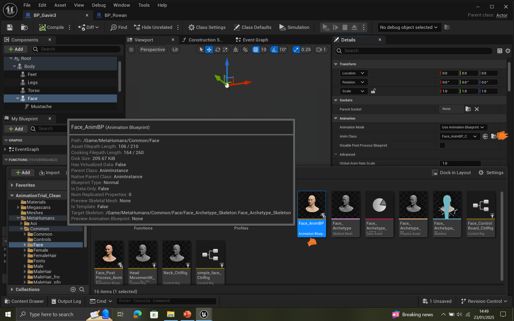

**_Tutorial: Applying Baked LiveLink Face Animations to Metahumans in Unreal Engine 5.3_**

1. _Record Face Animation_

I used a seperate project to record face animations with LiveLink. Bake the animation in the project that you recorded face animations. To do this,open the level sequencer of the recorded face animation. Right click on "Face" in the level sequecer and select "Bake Animation Sequence".

 

2. _Export the baked animation_
 
 
 Select "Asset Actions", then select "Export". There will be a pop up window named "FBX Export Options", select everything in the pop up and click on "Export to Animation"

 

3. Open the project where you want to apply face animation. Download the metahuman from the Quixel Bridge and add it to the project. 
! Make sure the Metahuman you downloaded is the same one you used used during face recording face animation. 
For this tutorial, I will use the Metahuman named Gavin3.

4. I have already created a folder called "Animation Sequences". Create a new folder called "Gavin3" under the Animations Sequences folder. 

5. Right-click inside the "Gavin3" folder and select "Import". Choose the baked animation .fbx file you exported earlier. 
There will be a pop up window called "FBX Import Options", make sure you select "Skeletal Mesh". Import mesh and animations. Then, click on "Import All". 

6. Open the blueprint of the metahuman that you downloaded. In my project, it is called "BP_Gavin3". Select "Body" in the "Components" section on the left. 
Then, go to "Anim Class" in the "Details" panel and choose "ABP_LookAtMetahuman" for the anim class. 

7. Select, "Face" in the "Components" section. Go to "Skeletal Mesh Asset" in the "Details" panel and click on the folder with magnifying glass. 

8. Open the "Gavin_3_FaceMesh" file. 

9. On the other side, go to "Metahuman sequences" folder, open "Gavin3" folder which you imported, open the "Skeletal Mesh" which is under the folder.

10. There are two files now for the face meshes of Gavin3. One of them is original, one of the is the one you imported. The new one is gray. The original face mesh, under the "Material Slots", should have 15 material slots, while the new (gray) one typically has 9 material slots. 
Copy the 15 material slots from the original mesh by going on top of it, do right click and copy. 

11. Go to the new mesh, increase the number of material slots from 9 to 15 using the + button. 

12. Paste the copied material slots into the gray mesh.  

13. Go to the "BP_Gavin3". Change the "Skeletal Mesh Asset" to the new mesh you imported.

14. Open another metahuman blueprint. (I will use BP_Rowan).
Copy the locations of all components under the Face and paste them into the corresponding locations in BP_Gavin3.

15. For each face object in BP_Gavin3, copy the "Attachment Name" in the "Details" panel and paste it into the "Parent Socket" field.
Repeat this for all face objects to make sure they remain attached.

16. Copy the "Widget" from the Face Component of a ready MetaHuman blueprint (BP_Rowan) and paste it into the same section in BP_Gavin3.

17. In BP_Rowan, go to the Event Graph. Copy the "Set Widget for X and O Alignment" nodes and paste them into the Event Graph of BP_Gavin3. Change Custom Event node to Event Begin Play node.

18. Create a new variable called Letter with the type Text. Set its default value to “0” in the Details panel.

19. In BP_Gavin3, under the Details panel for the Face component, click the magnifying glass next to Face_AnimBP_C to open the file.

20. In the Metahuman Sequences/Gavin3 folder, create a new animation blueprint by right clicking. Select the new face mesh you imported.  Name the file "abp_Gavin3_positive".

21. Copy the animation graph from Face_AnimBP_C and paste it into new animation blueprint called "abp_Gavin3_positive". Connect all nodes.

 

22. Create an arrow from Blend Pose 0 uder the Layered blend per bone node and search for Play Gavin3-Fred-Positive_Anim.  

23. Go to BP_Gavin3. In the "Details" panel for the Face component, set the Anim Class to "abp_Gavin3_positive".

24. Go to BP_Gavin3. Click on Class Settings on the toolbar. In the Details panel on the right side, go to Interfaces, click the + Add button next to the Implemented Interfaces. 
Under the available interfaces select the BPI_State Instructions. 

25. Then, go the Event Graph of the blueprint. Right-click in the graph and type the name of the event you want to implement (from the interface) which is Event Hide Mesh from BPI_Virtual Agent interface. 
On the left side you will see the interfaces which are Hide Mesh, Show Widget, Hide Widget and Get Widget Location. 
Go to ready metahuman and copy and paste the nodes  inside them.  